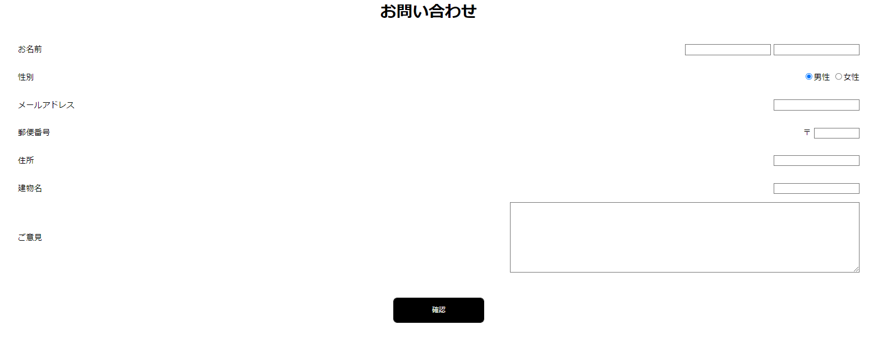
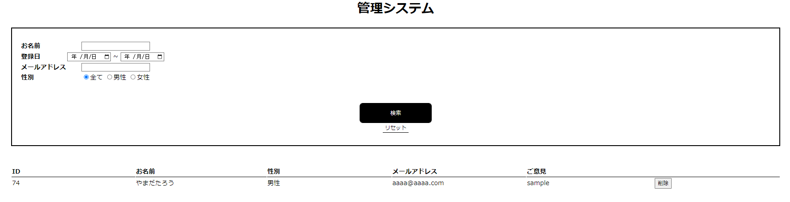
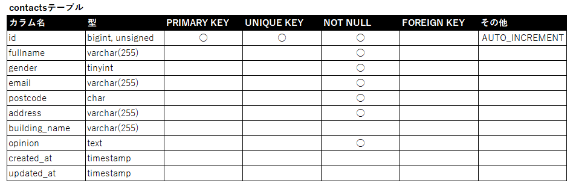

# アプリケーション
## 概要説明
>  
>「お問い合わせフォーム」です。
> ユーザーから投稿されたお問い合わせ内容をデータベースに保存します。
      
>    
> 管理画面では投稿されたお問い合わせ内容の一覧を表示します。
> 名前,登録日,メールアドレス,性別からお問い合わせ内容の検索ができます。
> 確認した内容は削除ボタンを押して削除することも出来ます。

## 目的
> 問い合わせの窓口用

## 機能一覧  
>お問い合わせの投稿
>内容確認画面の表示
>お問い合わせ一覧の表示,削除(管理画面)

## 使用技術（実行環境）
>Laravel Framework 8.83.18

## テーブル設計
>

## ER図
>

## 環境構築
>**プロジェクトをクローン**  
>`cd clone https://github.com/alogon10/advancedtest`  
>**vendarディレクトリの作成**  
>`cd advancedtest`  
>`composer install`  
>**.envの作成と設定**  
>`cp .env.example .env`  
>`php artisan key:generate`  
>`php artisan config:clear`  
>**データベース設定**  
>`php artisan migrate`  
>`php artisan db:seed`  
>**サーバーの起動**  
>`php artisan serve`  
